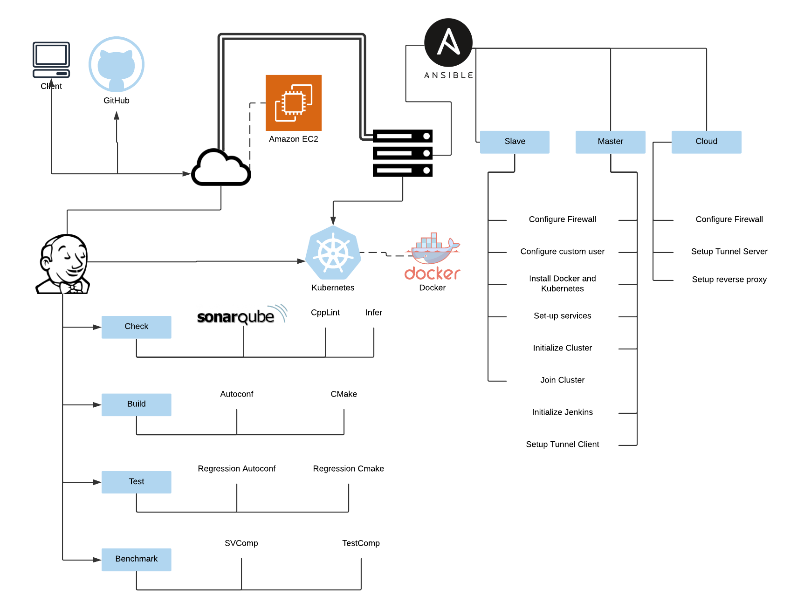

# ESBMC - Cluster Architecture

This document will explain the architecture and providing an
summary and base on the technologies used. This assumes that 
all machines are using CentOS or RHEL

## Overview



## Instructions

### Prerequisites

- Get the openvpn configuration file (ask it)

- SSH into the master host

Replace values in `./hosts` so it contains all hosts in the correct category:

```bash
cat hosts

[kubernete_master]
master-kubernete ansible_host=192.168.122.130

[kubernete_slave]
slave-1 ansible_host=192.168.122.184
slave-2 ansible_host=192.168.122.82
```

- Configure ssh with keys from master:

```bash
ssh-keygen
ssh-copy-id 192.168.122.130
ssh-copy-id 192.168.122.184
ssh-copy-id 192.168.122.82
```

- Edit `./group_vars/all` variables (`lan_range` should be the hosts network), e.g
my machines are all located in 192.168.122.* so I used 192.168.122.{1..253}

- Execute `root.sh` as a priviliged user, this will install ansible:

```bash
chmod +x ./root.sh
sudo ./root.sh
```

- Before proceding **ensure** that the following command results in SUCCESS for all slaves and master:

```bash
ansible -i hosts all -m ping
```
NOTE: When asked about **become**, is your **sudo** password.

### Kubernete Cluster

- To set-up the cluster, run:

```bash
./run-playbook.sh setup_kubernete_cluster.yml
```

To check, ssh into esbmc@localhost (in the master) and run `kubectl get nodes`

### OpenVPN

- First, put the `cluster.conf` file inside the `files` directory

- Run:
```bash
./run-playbook.sh setup_openvpn.yml
```

### Jenkins

- This assumes that kubernetes is up and running

- To set-up jenkins, run:

```bash
./run-playbook.sh setup_jenkins.yml
```

Then, access `http://<master_kubernetes>:8080`

NOTE: This will create `certfiles` folder inside `jenkins` this will be used later!

#### Initial Setup

Saddly I don't know the best way to automate Jenkins without creating a docker image, which is not the
way that it was configured. So we have to go through the GUI. Follow the steps:

1. Access `http://<master_kubernetes>:8080`;

2. SSH into `<master_kubernetes>` and execute as superuser `cat /var/lib/jenkins/secrets/initialAdminPassword` copy the value and paste it into the Jenknins configuration;

3. Install suggested plugins;

4. Create the Admin User;

5. In Jenkins URL put the Reverse Proxy DNS or address(ask)

#### Plugins Configuration
1. Go to Manage Jenkins -> Manage Plugins
2. In the table go to Available
3. Mark: "Blue Ocean", "GitHub Pipeline for Blue Ocean", "	
Dashboard for Blue Ocean", "Kubernetes"
4. Click on "Download now and install after restart"
5. Mark "Restart Jenkins when installation is complete and no jobs are running"

#### Kubernetes Configuration
1. Go to Manage Jenkins -> Configure System
1. Set "# of executors" to 0
1. At the bottom, in the "Cloud", click on "Add a new cloud"
1. Kubernetes URL: https://**master-ip**:6443
1. Kubernetes server certificate key: Copy the contents from `./jenkins/certfiles/ca.crt`
1. Kubernetes Namespace: default
1. In Credential, click in Add -> Jenkins
1. In Kind, set Certificate and upload ./jenkins/certfiles/cert.pfx`, in password put the value inside `group_vars/all` 
1. Now, in Credential put the certificate. Click in "Test Connection", it should run successfully
1. In Jenkins URL, put the http://**master-ip**:8080
1. Now, let all values default, until Images. Click in Add Pod Template.
1. Name: jnlp slave
1. Namespace: default
1. Usage: Use this node as much as possible
1. Add Container
1. Name: knlp
1. Docker image: jenkins/jnlp-slave
1. Working directory: /home/jenkins/
1. Command to run: EMPTY
1. Arguments to pass to the command: EMPTY
1. Save
1. Go to Manage Jenkins -> Configure Global Security
1. TCP port for inbound agents: Fixed: 50000
 
#### GitHub Configuration
To add a GitHub repository:

1. Go to "Open Blue Ocean"
2. Click in "New Pipeline"
3. Follow the guide to add the repo

Now go to your repository in GitHub
1. Click in Settings -> Webhooks
1. Payload URL: https://reverse-proxy.com/github-webhook
1. Content type: application/json
1. Enable SSL Verification
1. Send me everything

## TODO

- [ ] Automate cloud configuration
- [ ] Automate Jenkins configuration (by hand or using docker)
